# Database Schema

Stegodon uses SQLite with WAL mode for data storage. The schema supports both local user management and ActivityPub federation.

## Entity Relationship Diagram

```mermaid
erDiagram
    accounts {
        TEXT id PK
        TEXT username UK
        TEXT publickey UK
        TIMESTAMP created_at
        INTEGER first_time_login
        TEXT web_public_key
        TEXT web_private_key
        TEXT display_name
        TEXT summary
        TEXT avatar_url
        INTEGER is_admin
        INTEGER muted
        INTEGER banned
        TEXT last_ip
    }

    notes {
        TEXT id PK
        TEXT user_id FK
        TEXT message
        TIMESTAMP created_at
        TIMESTAMP edited_at
        TEXT visibility
        TEXT in_reply_to_uri
        TEXT object_uri
        INTEGER federated
        INTEGER sensitive
        TEXT content_warning
        INTEGER reply_count
        INTEGER like_count
        INTEGER boost_count
    }

    follows {
        TEXT id PK
        TEXT account_id FK
        TEXT target_account_id FK
        TEXT uri
        TIMESTAMP created_at
        INTEGER accepted
        INTEGER is_local
    }

    remote_accounts {
        TEXT id PK
        TEXT username
        TEXT domain
        TEXT actor_uri UK
        TEXT display_name
        TEXT summary
        TEXT inbox_uri
        TEXT outbox_uri
        TEXT public_key_pem
        TEXT avatar_url
        TIMESTAMP last_fetched_at
    }

    activities {
        TEXT id PK
        TEXT activity_uri UK
        TEXT activity_type
        TEXT actor_uri
        TEXT object_uri
        TEXT raw_json
        INTEGER processed
        TIMESTAMP created_at
        INTEGER local
        INTEGER from_relay
        INTEGER reply_count
        INTEGER like_count
        INTEGER boost_count
    }

    likes {
        TEXT id PK
        TEXT account_id FK
        TEXT note_id FK
        TEXT uri
        TEXT object_uri
        TIMESTAMP created_at
    }

    boosts {
        TEXT id PK
        TEXT account_id FK
        TEXT note_id FK
        TEXT remote_account_id FK
        TEXT uri
        TEXT object_uri
        TIMESTAMP created_at
    }

    delivery_queue {
        TEXT id PK
        TEXT inbox_uri
        TEXT activity_json
        INTEGER attempts
        TIMESTAMP next_retry_at
        TIMESTAMP created_at
        TEXT account_id FK
    }

    hashtags {
        INTEGER id PK
        TEXT name UK
        INTEGER usage_count
        TIMESTAMP last_used_at
    }

    note_hashtags {
        TEXT note_id PK,FK
        INTEGER hashtag_id PK,FK
    }

    note_mentions {
        TEXT id PK
        TEXT note_id FK
        TEXT mentioned_actor_uri
        TEXT mentioned_username
        TEXT mentioned_domain
        TIMESTAMP created_at
    }

    relays {
        TEXT id PK
        TEXT actor_uri UK
        TEXT inbox_uri
        TEXT follow_uri
        TEXT name
        TEXT status
        INTEGER paused
        TIMESTAMP created_at
        TIMESTAMP accepted_at
    }

    notifications {
        TEXT id PK
        TEXT account_id FK
        TEXT notification_type
        TEXT actor_id
        TEXT actor_username
        TEXT actor_domain
        TEXT note_id
        TEXT note_uri
        TEXT note_preview
        INTEGER read
        TIMESTAMP created_at
    }

    bans {
        TEXT id PK
        TEXT account_id FK
        TEXT banned_by FK
        TEXT reason
        TIMESTAMP created_at
    }

    info_boxes {
        TEXT id PK
        TEXT title
        TEXT content
        INTEGER order_num
        INTEGER enabled
        TIMESTAMP created_at
        TIMESTAMP updated_at
    }

    upload_tokens {
        TEXT token PK
        TEXT account_id FK
        TEXT token_type
        TIMESTAMP created_at
        TIMESTAMP expires_at
    }

    server_message {
        INTEGER id PK
        TEXT message
        INTEGER enabled
        INTEGER web_enabled
        TIMESTAMP updated_at
    }

    terms_and_conditions {
        INTEGER id PK
        TEXT content
        TIMESTAMP updated_at
    }

    user_terms_acceptance {
        INTEGER id PK
        TEXT user_id FK
        INTEGER terms_id FK
        TIMESTAMP accepted_at
    }

    accounts ||--o{ notes : "creates"
    accounts ||--o{ bans : "receives"
    accounts ||--o{ follows : "follower"
    accounts ||--o{ likes : "likes"
    accounts ||--o{ boosts : "boosts"
    accounts ||--o{ delivery_queue : "owns"
    accounts ||--o{ notifications : "receives"
    notes ||--o{ likes : "receives"
    notes ||--o{ boosts : "receives"
    notes ||--o{ note_hashtags : "has"
    notes ||--o{ note_mentions : "mentions"
    hashtags ||--o{ note_hashtags : "used_in"
    remote_accounts ||--o{ follows : "federated_follow"
    accounts ||--o{ upload_tokens : "owns"
    accounts ||--o{ user_terms_acceptance : "accepts"
    terms_and_conditions ||--o{ user_terms_acceptance : "accepted_by"
```

## Tables

### accounts
Local user accounts. Each user authenticates via SSH public key and has an RSA keypair for ActivityPub signing.

### notes
User-created posts. Supports visibility settings, content warnings, threading via `in_reply_to_uri`, and federation status. Includes denormalized engagement counters (`reply_count`, `like_count`, `boost_count`) for efficient display.

### follows
Follow relationships between accounts. Can represent local-to-local, local-to-remote, or remote-to-local follows. The `is_local` flag indicates whether the target is a local user.

### remote_accounts
Cached ActivityPub actors from other servers. Includes public keys for signature verification and inbox URIs for delivery. Cached data has a 24-hour TTL before refresh.

### activities
Log of all ActivityPub activities (incoming and outgoing). Stores raw JSON for debugging and replay. The `from_relay` flag indicates content forwarded via relay subscriptions. Includes denormalized engagement counters for remote posts displayed in timelines.

### likes
Like/favorite relationships between accounts and notes. For local notes, `note_id` references the note directly. For remote/federated posts, `object_uri` stores the ActivityPub object URI and `note_id` contains a deterministic placeholder UUID derived from the object URI (to satisfy the unique constraint).

### boosts
Boost/reblog relationships between accounts and notes. Created when receiving `Announce` activities or when a local user boosts a post.

| Column | Description |
|--------|-------------|
| `account_id` | Local account that created the boost (for local user boosts) |
| `note_id` | Local note being boosted (if boosting a local post) |
| `remote_account_id` | Remote account that created the boost (for incoming boosts from followed users) |
| `object_uri` | ActivityPub URI of the boosted object (for remote posts) |
| `uri` | ActivityPub URI of the Announce activity |

For local user boosts: `account_id` + `note_id` or `account_id` + `object_uri`
For remote user boosts: `remote_account_id` + `note_id` or `remote_account_id` + `object_uri`

### delivery_queue
Background queue for federating activities to remote servers. Supports retry with exponential backoff (1 minute to 24 hours).

### hashtags
Hashtag registry tracking usage counts for discovery and trending features.

### note_hashtags
Junction table linking notes to their hashtags (many-to-many relationship).

### note_mentions
Stores @username@domain mentions found in notes. Used for notification features and tracking who is mentioned in posts. Mentions are parsed from both local notes and incoming federated activities.

### relays
ActivityPub relay subscriptions for receiving federated content from relay servers. Supports both FediBuzz-style (hashtag-based, Announce-wrapped) and YUKIMOCHI-style (raw Create forwarding) relays.

| Column | Description |
|--------|-------------|
| `actor_uri` | The relay's actor URI (e.g., `https://relay.fedi.buzz/tag/music`) |
| `inbox_uri` | The relay's inbox URI for delivering Follow/Undo activities |
| `follow_uri` | The URI of our Follow activity (needed for Undo) |
| `name` | Display name from relay actor profile |
| `status` | Subscription status: `pending`, `active`, or `failed` |
| `paused` | If true, incoming content from this relay is logged but not saved |
| `accepted_at` | When the relay accepted our Follow request |

### notifications
User notifications for social interactions. Notifications appear in real-time in the TUI with a badge counter in the header. Uses an inbox-zero pattern where notifications are deleted on acknowledgment.

| Column | Description |
|--------|-------------|
| `id` | Unique notification identifier (UUID) |
| `account_id` | The user receiving the notification |
| `notification_type` | Type: `like`, `follow`, `mention`, or `reply` |
| `actor_id` | UUID of the account that triggered the notification |
| `actor_username` | Username of the actor (without domain for local users) |
| `actor_domain` | Domain of the actor (empty for local users) |
| `note_id` | Related note UUID (for like, mention, reply types) |
| `note_uri` | ActivityPub URI of the related note |
| `note_preview` | Text preview of the note content |
| `read` | Whether the notification has been read (0 or 1) |
| `created_at` | When the notification was created |

### bans
Records of banned user accounts. When an admin bans a user, a record is created here and the `banned` flag is set on the account.

| Column | Description |
|--------|-------------|
| `id` | Unique ban record identifier (UUID) |
| `account_id` | The banned user account |
| `banned_by` | The admin account that issued the ban |
| `reason` | Optional reason for the ban |
| `created_at` | When the ban was issued |

### info_boxes
Customizable content boxes displayed on the web homepage. Admins can create, reorder, enable/disable, and edit boxes to show announcements or information.

| Column | Description |
|--------|-------------|
| `id` | Unique identifier (UUID) |
| `title` | Box title |
| `content` | Box content (text) |
| `order_num` | Display order (lower = higher) |
| `enabled` | Whether the box is visible (0 or 1) |
| `created_at` | When the box was created |
| `updated_at` | Last modification timestamp |

### upload_tokens
One-time-use tokens for avatar uploads via the web browser. Generated from the TUI, consumed when the upload completes.

| Column | Description |
|--------|-------------|
| `token` | Unique token string (primary key) |
| `account_id` | The account this token belongs to |
| `token_type` | Type of upload (e.g., `avatar`) |
| `created_at` | When the token was created |
| `expires_at` | When the token expires (10 minutes by default) |

### server_message
Single-row table storing an admin-configurable server announcement. Displayed in the TUI and optionally on the web interface.

| Column | Description |
|--------|-------------|
| `id` | Always 1 (single-row constraint) |
| `message` | The announcement text |
| `enabled` | Whether the message is shown in TUI (0 or 1) |
| `web_enabled` | Whether the message is shown on the web (0 or 1) |
| `updated_at` | Last modification timestamp |

### terms_and_conditions
Stores terms of service content. When `STEGODON_SHOW_TOS` is enabled, users must accept the current terms before using the TUI.

| Column | Description |
|--------|-------------|
| `id` | Auto-incrementing identifier |
| `content` | The terms text |
| `updated_at` | When the terms were last modified |

### user_terms_acceptance
Tracks which users have accepted which version of the terms. When terms are updated, users must re-accept.

| Column | Description |
|--------|-------------|
| `id` | Auto-incrementing identifier |
| `user_id` | The accepting user account (UUID) |
| `terms_id` | The terms version accepted |
| `accepted_at` | When the user accepted |

### accounts (additional columns)

| Column | Description |
|--------|-------------|
| `banned` | Whether the account is banned (0 or 1) |
| `last_ip` | Last known IP address of the user (for admin visibility) |

## Indexes

| Table | Index | Columns |
|-------|-------|---------|
| accounts | idx_accounts_username | username (unique, case-insensitive) |
| notes | idx_notes_user_id | user_id |
| notes | idx_notes_created_at | created_at DESC |
| notes | idx_notes_object_uri | object_uri |
| notes | idx_notes_in_reply_to_uri | in_reply_to_uri |
| follows | idx_follows_account_id | account_id |
| follows | idx_follows_target_account_id | target_account_id |
| follows | idx_follows_uri | uri |
| remote_accounts | idx_remote_accounts_actor_uri | actor_uri |
| remote_accounts | idx_remote_accounts_domain | domain |
| activities | idx_activities_uri | activity_uri |
| activities | idx_activities_processed | processed |
| activities | idx_activities_type | activity_type |
| activities | idx_activities_created_at | created_at DESC |
| activities | idx_activities_object_uri | object_uri |
| activities | idx_activities_from_relay | from_relay |
| likes | idx_likes_note_id | note_id |
| likes | idx_likes_account_id | account_id |
| likes | idx_likes_object_uri | object_uri |
| boosts | idx_boosts_note_id | note_id |
| boosts | idx_boosts_account_id | account_id |
| boosts | idx_boosts_remote_account_id | remote_account_id |
| boosts | idx_boosts_object_uri | object_uri |
| bans | idx_bans_account_id | account_id |
| delivery_queue | idx_delivery_queue_next_retry | next_retry_at |
| hashtags | idx_hashtags_name | name |
| hashtags | idx_hashtags_usage | usage_count DESC |
| note_hashtags | idx_note_hashtags_note_id | note_id |
| note_hashtags | idx_note_hashtags_hashtag_id | hashtag_id |
| note_mentions | idx_note_mentions_note_id | note_id |
| note_mentions | idx_note_mentions_actor_uri | mentioned_actor_uri |
| relays | idx_relays_status | status |
| notifications | idx_notifications_account_id | account_id |
| notifications | idx_notifications_created_at | created_at DESC |
| notifications | idx_notifications_account_read | account_id, read |

## Denormalized Counters

For performance optimization, engagement counts are denormalized on both `notes` and `activities` tables:

| Column | Description |
|--------|-------------|
| `reply_count` | Total number of replies (including nested sub-replies, recursively counted) |
| `like_count` | Number of likes/favorites received |
| `boost_count` | Number of boosts/reblogs received |

These counters are:
- **Incrementally updated** when new replies, likes, or boosts are received
- **Decremented** when replies are deleted or likes/boosts are undone
- **Deduplicated** to avoid counting federated copies of local posts twice
- **Backfilled** during database migration for existing data
