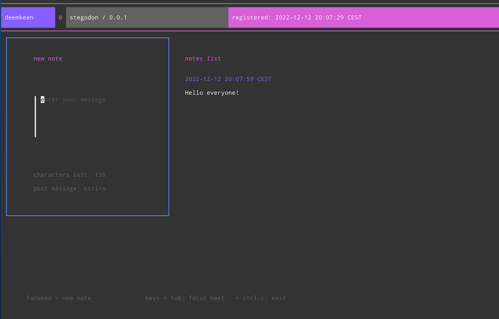

# stegodon

**stegodon** is a simple, single user blog tui-application written in Golang, using the wonderful [Charm Tools](https://github.com/charmbracelet).
It allows users to create notes, as well as view them in a clean and easy to navigate console interface. 
It is also possible to subscribe to these notes via RSS and to federate via ActivityPub (WIP!)

## Features

- Create and view notes
- Subscribe via RSS
- *Delete, update notes (TBD)*
- *Subscribe via ActivityPub (TBD)*
- *Markdown support for post formatting (TBD)*
- *Customizable theme and layout options (TBD)*

## Installation

1. Clone the repository: `git clone https://github.com/deemkeen/stegodon`
2. Install dependencies: `go get -d`
3. Build the application: `go build`
4. Start the server: `./stegodon`

## Usage

Once the server is started, open an ssh session via `ssh 127.0.0.1 -p 23232` to access the application.
You will be authenticated with your own ssh key. On your first login it is necessary to choose a username.
From there, you can create the notes.
After adding notes, you can get an RSS-Feed with your personal notes via `http://127.0.0.1:9999/feed?username=<youruser>`

**stegodon** can be used as a multiuser system, if you expose your server to the internet. Every user will get a dedicated
account, accessible with the personal ssh user key. An aggregated RSS-Feed with all user notes is accessible via `http://127.0.0.1:9999/feed`

Custom configuration can be applied by setting the following environment variables:

- **STEGODON_HOST** (your local server ip, default: 127.0.0.1)
- **STEGODON_SSHPORT** (ssh login port, default: 23232)
- **STEGODON_HTTPPORT** (http port, default: 9999)
- **STEGODON_SSLDOMAIN** (your optional hosted ssl domain, default: example.com)
- **STEGODON_WITH_AP** (turn on ActivityPub functionality, default: false)

## Tech

The SSH login functionality is provided by [wish](https://github.com/charmbracelet/wish).
The TUI is powered by [bubbletea](https://github.com/charmbracelet/bubbletea) and [lipgloss](https://github.com/charmbracelet/lipgloss).
**stegodon** persists all the data in a local SQLite database, which can be deleted, if you want to wipe all your notes.

For optimal results, it's recommended to use a terminal with:

- True Color (24-bit) support;
- at least 160 columns and 50 rows.

## LICENSE

MIT

## Contributing

Contributions are welcome! Please open a pull request or issue on the GitHub repository. As a Java developer,
this is my first Golang App, so don't be too hard on me about the code ;)
